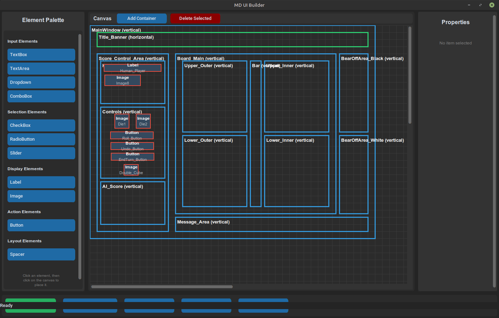

# MD UI Builder

A visual UI builder that generates markdown representations of user interfaces for easy communication with AI agents.



## Overview

MD UI Builder allows you to visually design user interfaces using a drag-and-drop interface and export them as standardized markdown documents. These markdown files can then be shared with AI agents to implement the UI in various frameworks (PyQt, CustomTkinter, HTML/CSS, etc.).

## Features

- **Visual UI Builder**: Drag-and-drop interface for building UIs
- **Container-Based Layout**: Use rectangular containers (horizontal/vertical) to structure your UI
- **Rich Element Library**: Buttons, labels, text boxes, dropdowns, checkboxes, and more
- **Markdown Export**: Generate standardized markdown representations
- **Framework-Agnostic**: Output works with PyQt, CustomTkinter, HTML/CSS, and other frameworks
- **Import/Export**: Save and load your UI designs

## Installation

1. Clone this repository
2. Install dependencies:
```bash
pip install -r requirements.txt
```

## Usage

Run the application:
```bash
python main.py
```

### Building a UI

1. **Add Containers**: Click "Add Container" to create rectangular layout areas
2. **Configure Containers**: Set orientation (horizontal/vertical), size, and position
3. **Add Elements**: Drag UI elements from the palette into containers
4. **Set Properties**: Click elements to edit their properties
5. **Export**: Click "Export to Markdown" to generate the markdown file

### Using the Markdown Output

Share the generated markdown file with AI agents with prompts like:
- "Implement this UI in PyQt"
- "Create this interface using CustomTkinter"
- "Build this layout in HTML/CSS"

## Markdown Schema

See [UI_SCHEMA.md](UI_SCHEMA.md) for detailed documentation on the markdown format.

## License

MIT License

